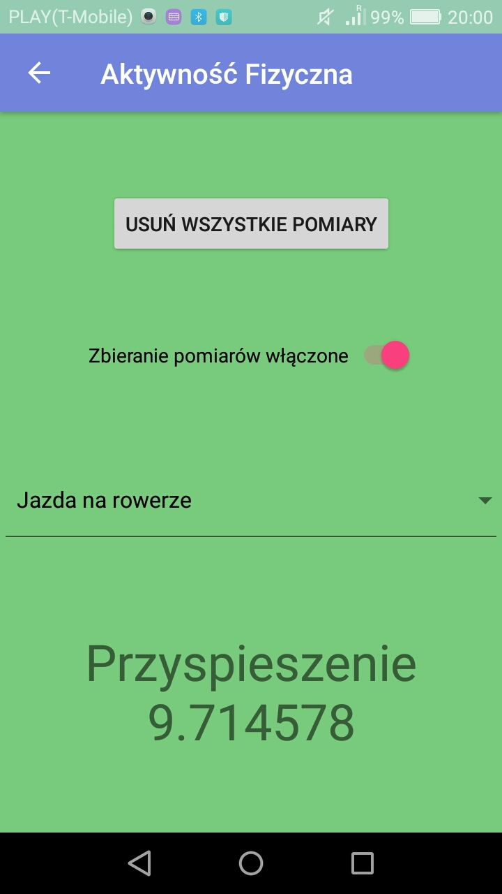
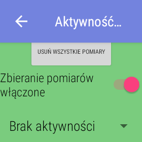
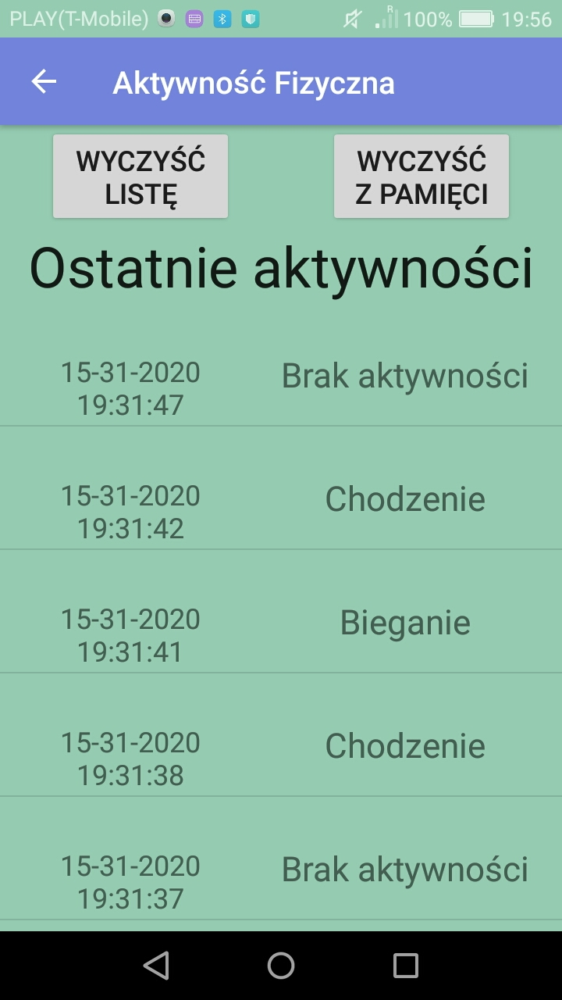
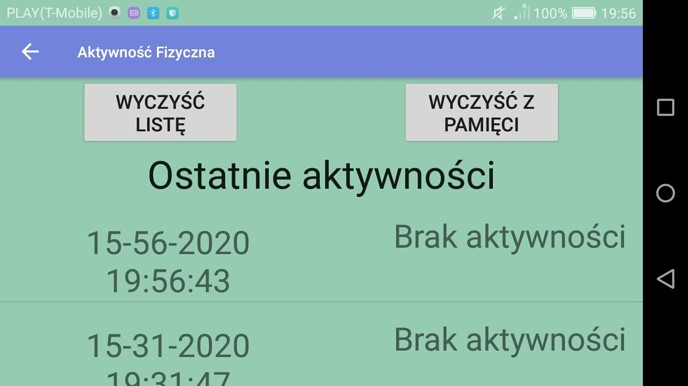
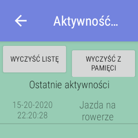

# Rozpoznawanie aktywności fizycznej na podstawie danych z akcelerometru

## Cel projektu

Projekt zrealizowałem w trakcie studiów w ramach kursu: programowanie systemów mobilnych. Celem projektu było stworzenie aplikacji mobilnej rozpoznającej wykonywaną aktywność fizyczną na podstawie danych z akcelerometru. 

## Technologie
* Android Studio, Java
* IntelliJ IDEA 2019.2.4
* DeepLearning4J
* SQLite
* Bluetooth

## Funkcjonalności
* zbieranie danych z akcelerometru i zapisywanie ich do bazy danych SQLite
* rozpoznawanie aktywności fizycznej i zapisywanie jej do bazy danych SQLite
* wysyłanie bazy danych przez Bluetooth
* responsywny interfejs użytkownika
* możliwość modyfikacji aplikacji, tak aby służyła do analizy danych z czujników telefonu

## Zrzuty ekranu aplikacji mobilnej

### Menu główne

### Zbieranie pomiarów

### Śledzenie aktywności

## Konfiguracja oprogramowania

### Uruchomienie aplikacji mobilnej AktywnośćFizyczna

1. Uruchom program **Android Studio**.
2. Otwórz projekt zawarty w folderze [/AktywnośćFizyczna](AktywnoscFizyczna).
3. Wybierz w menu **Build** -> **Build Bundle(s) / APK(s)** -> **Build APK(s)**
4. Po wygenerowaniu APK wyświetli się powiadomienie. Należy kliknąć podkreślony link "locate" znajdujący się w powiadomieniu.
5. Podłącz telefon do komputera za pomocą kabla USB
6. Skopiuj plik **.apk** do pamięci wewnętrznej telefonu
7. Znajdź plik **.apk** na telefonie i zainstaluj aplikację na telefonie.
8. Uruchom zainstalowaną aplikację.

### Zebranie pomiarów za pomocą aplikacji mobilnej

1. Z menu aplikacji wybierz **ZBIERZ POMIARY**.
2. Ustaw wykonywaną aktywność.
3. Włącz zbieranie pomiarów.
4. Dokonaj zmiany wykonywanej aktywności jeśli ona się zmieni
5. Wyłącz zbieranie pomiarów.

### Przesłanie pomiarów przez Bluetooth z telefonu na komputer

1. Powróć do menu.
2. Włącz w komputerze i telefonie Bluetooth
3. Przybliż telefon do komputera
4. Zparuj telefon z komputerem.
5. Z menu aplikacji wybierz opcję **PRZEŚLIJ DANE PRZEZ BLUETOOTH**.
6. Wybierz w telefonie komputer do którego zostanie wysłany plik
7. W ustawieniach(na komputerze) dotyczących Bluetooth wybierz **Wyślij lub odbierz pliki przez Bluetooth**
8. Po pojawieniu się okna kliknij **Odbierz plik**
9. Zapisz plik **SensorDatabase.db** w katalogu [dl4j-examples\src\main\resources\uci\train](dl4j-examples\src\main\resources\uci\train)
10. Uruchom program getData.py znajdujący się w katalogu [dl4j-examples\src\main\resources\uci\train](dl4j-examples\src\main\resources\uci\train)
11. Skopiuj plik **label_dict.txt** (katalog [dl4j-examples\src\main\resources\uci\train](dl4j-examples\src\main\resources\uci\train)) do katalogu [AktywnoscFizyczna\app\src\main\res\raw](AktywnoscFizyczna\app\src\main\res\raw)

### Wytrenowanie modelu sieci neuronowej

1. Otwórz plik [LSTMNetwork.java](dl4j-examples\src\main\java\org\deeplearning4j\examples\feedforward\mnist\LSTMNetwork.java) (katalog [dl4j-examples\src\main\java\org\deeplearning4j\examples\feedforward\mnist](dl4j-examples\src\main\java\org\deeplearning4j\examples\feedforward\mnist)) w **IntelliJ**
2. Uruchom program poprzez wybranie w menu **Run** -> **Run 'LSTMNetwork'**
3. Skopiuj plik **trained_seq_model.zip** (katalog [dl4j-examples](dl4j-examples)) do katalogu [AktywnoscFizyczna\app\src\main\res\raw](AktywnoscFizyczna\app\src\main\res\raw)

### Zastosowanie sieci neuronowej do rozpoznawania aktywności fizycznej
1. Zainstaluj aplikację mobilną **Aktywność Fizyczna** ze zmodyfikowaną siecią neuronową.
2. Uruchom zainstalowaną aplikację.
3. W menu wybierz **ŚLEDŹ AKTYWNOŚĆ**.

## TODO
* Dobranie parametrów sieci neuronowej
* Filtrowanie danych
* Interfejs użytkownika upraszczający proces konfiguracji oprogramowania
 
## Części kodu z internetu
* MainActivity.java na podstawie 
https://stackoverflow.com/questions/4573761/bluetooth-file-transfer-in-android
* Pomiary.java i AktywnoscFizyczna.java na podstawie https://developer.android.com/guide/topics/sensors/sensors_overview oraz https://deeplearning4j.org/docs/latest/deeplearning4j-cheat-sheet
* DatabaseHelper.java na podstawie https://guides.codepath.com/android/local-databases-with-sqliteopenhelper
* ObjectSerializer.java pochodzi ze strony https://github.com/apache/pig/blob/89c2e8e76c68d0d0abe6a36b4e08ddc56979796f/src/org/apache/pig/impl/util/ObjectSerializer.java